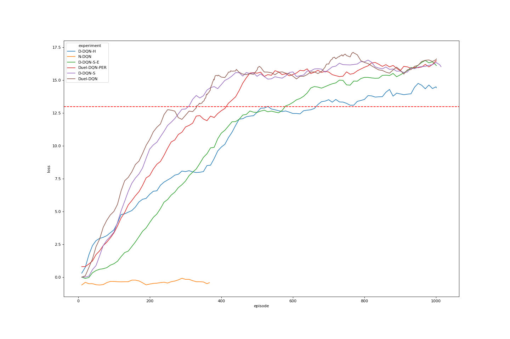

# Comparison of DQN, Dual DQN, Duelling DQN and prioritized expirience replay on Banana environment

## Overview
I've tested a number of deep RL approaches to solve enviroment proposed at Udacity deep RL nanodegree.
That's not a grid search or any other meaningfull comparison, due to a large number of hyperparamenters, that are not directly
comparable between methods. It is merely a set of random attempts, looking a qualitative difference between methods.

## DQN

Two baseline NN archtectures were used:
 - "naive" 3 fully connected layers intermixed with ReLu activations, mapping 37 input space to 4 action states outputs with 64-dim hidden layers.
 - dueling DQN architecture, using 64 hidden dims as well [article](https://arxiv.org/abs/1511.06581)  

## Ideas tested
 - "Naive" DQN (N-DQN)
 - Dual DQN with soft updates (D-DQN-S)
 - Dual DQN with soft updates with Epsilon 0.98 (D-DQN-S-E)
 - Dual DQN with hard update (D-DQN-H)
 - Duelling DQN with soft updates (Duel-DQN)
 - Duelling DQN with soft updates and prioritized expirince replay (Duel-DQN - PER)
 
## Results

| Method        | Is solved? | Solved on episode | Max score | Max score on episode|
| ------------- |:----------:| -----------------:| ---------:|--------------------:|
| N-DQN         | no         |                   |  -0.09    |    290              |
| D-DQN-S       | yes        |       310         |   16.54   |    810              |
| D-DQN-S-E     | yes        |       580         |   16.41   |    990              |
| D-DQN-H       | yes        |       530         |   14.76   |    990              |
| Duel-DQN      | yes        |       331         |   17.13   |    768              |
| Duel-DQN - PER| yes        |       410         |   16.49   |    1000             |

## Discussion

 - "Naive" DQN didn't archive any training progress
 - Soft updates in dual DQN approach is better than "traditional" hard one
 - Duelling DQN gives noticable performance boost
 - I wansn't able to find a set of hyperparameters that made prioritized expirience replay better than soft update duelling DQN 

## Further research
 - Do a random grid serach of existing best solution hyperparameters
 - Try to find a set of parameters to have new best record with PER
 - Continue implementation of best approaches, mostly focusing on (Rainbow paper)[https://arxiv.org/abs/1710.02298] 

